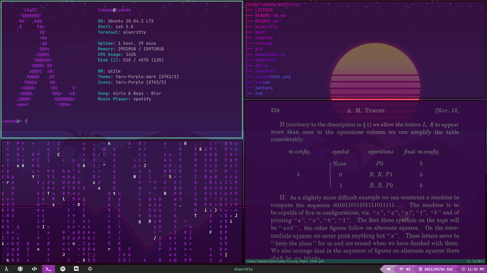

# AugustoNicola/dotfiles
## My personal linux dotfiles

 

## Packages
* [Alacritty](alacritty/alacritty)
* [Bash](bash)
* [Compton](compton/compton)
* [Crontab](crontab)
* [Plymouth](plymouth/circle)
* [Neofetch](neofetch/neofetch)
* [Qtile](qtile/qtile)
* [Redshift](redshift)
* [Rofi](rofi/rofi)
* [VSCode](vscode)
* [Zathura](zathura)
* [Zsh](zsh/zsh)

 

### [README en español acá :argentina: :mexico:](README.md)

 
These are the configuration files from the software that I use regularly: that includes my window manager, text editors, shell and some more, ~~mostly~~ documented with comments in english. **Feel free to read, copy or fork the code that you need!**

For managing the files, I use a small script that uses [GNU stow](https://www.gnu.org/software/stow/) to create symlinks to whenever the config files are expected, while actually residing in the same `~/dotfiles` directory, which makes it really easy to manage. For more information on how to use GNU stow for dotfiles check out [this awesome video by the youtouber Tech Pills](https://www.youtube.com/watch?v=GqL6W-ua7uQ)

 

### Usage
In order to use my dotfiles, first clone the repo wherever you want to keep your dotfiles in your machine, and then move to that directory.

	$ git clone https://github.com/AugustoNicola/dotfiles.git
	$ cd dotfiles/

Then just use the `makelinks.sh` script:

**Warning: using this script will OVERRIDE all past configuration files for the specified packages. Making a backup is advised.**

* For specific packages
		
		$ ./makelinks.sh package1 package2 ...

* For all packages

		$ ./makelinks.sh -a
		
		
* Listing all available packages

		$ ./makelinks.sh -l
		
 

###  Contributing
Contributing in any way (such as proposing different configurations, upgrading the documentation or suggesting better ways of handling the files) are always welcome, and will be thoroughly appreciated!
