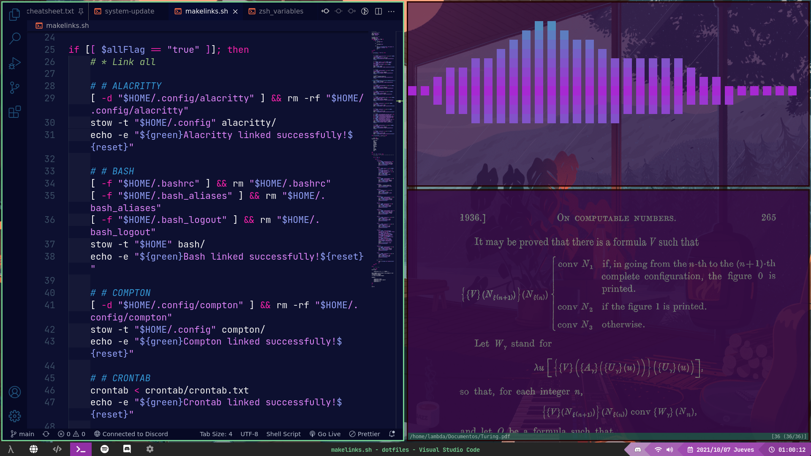

# AugustoNicola/dotfiles
## Mis archivos de configuración personales

 

 

### [English README here :uk: :us:](README-EN.md)

 

## Paquetes
* [Alacritty](alacritty/alacritty)
* [Bash](bash)
* [Compton](compton/compton)
* [Crontab](crontab)
* [Mis Scripts](scripts/Scripts)
* [Neofetch](neofetch/neofetch)
* [Plymouth](plymouth/circle)
* [Qtile](qtile/qtile)
* [Redshift](redshift)
* [Rofi](rofi/rofi)
* [Vis](vis/vis)
* [VSCode](vscode)
* [Zathura](zathura)
* [Zsh](zsh/zsh)

Estos son los archivos de configuración que uso: mi gestor de ventanas, editor de texto, shell y algunos más, ~~en su mayoría~~ con comentarios en inglés. **¡Podés leer, usar o modificar el código que necesites!**

Para administrar los archivos, uso un script que con la ayuda de [GNU stow](https://www.gnu.org/software/stow/) crea enlaces simbólicos hacia donde sean necesarios los archivos, mientras que en realidad están en un mismo directorio `~/dotfiles`, por lo que es muy fácil de manejar. Para más información acerca de cómo usar GNU stow para manejar archivos de configuración está [este video del youtuber Tech Pills](https://www.youtube.com/watch?v=GqL6W-ua7uQ)

 

## Cómo Usar
Para poder usar mis archivos, primero tenés que copiar el repositorio donde quieras guardar las configuraciónes y moverte al directorio:

	$ git clone https://github.com/AugustoNicola/dotfiles.git
	$ cd dotfiles/
	
Luego solo resta usar el script `makelinks.sh`:

**Cuidado: este script va a SOBREESCRIBIR cualquier configuración previa para los paquetes especificados. Se recomienda hacer una copia de seguridad**

* Para instalar paquetes particulares
	
		$ ./makelinks.sh paquete1 paquete2 ...
		
* Para instalar todos los paquetes

		$ ./makelinks.sh -a
		
* Para listar los paquetes disponibles

		$ ./makelinks.sh -l

 

##  Contribuciones
Contribuir de cualquier manera (como puede ser proponer nuevas configuraciones, mejorar la documentación del código, o sugerir mejoras en el manejo de archivos) son siempre bienvenidas, y serán agradecidas!
